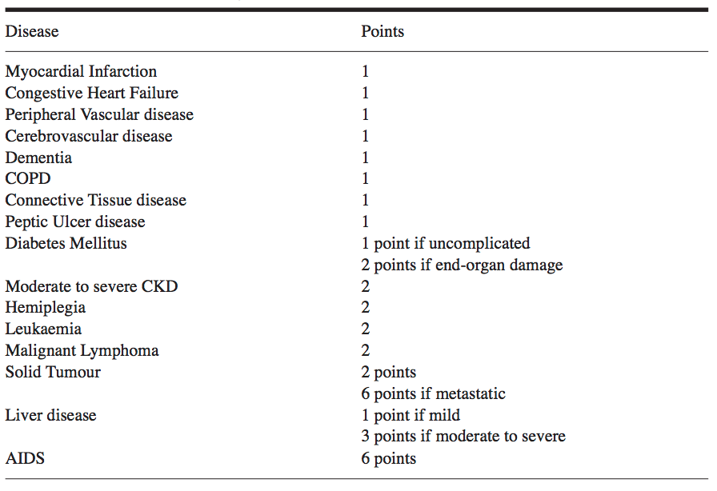
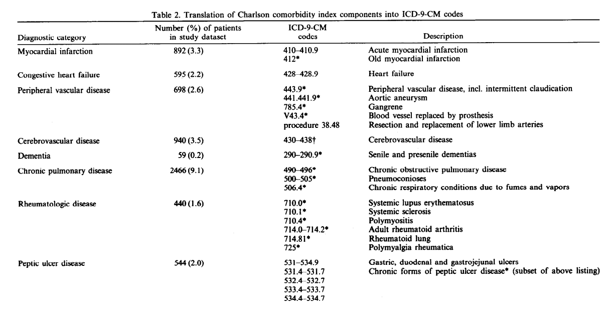
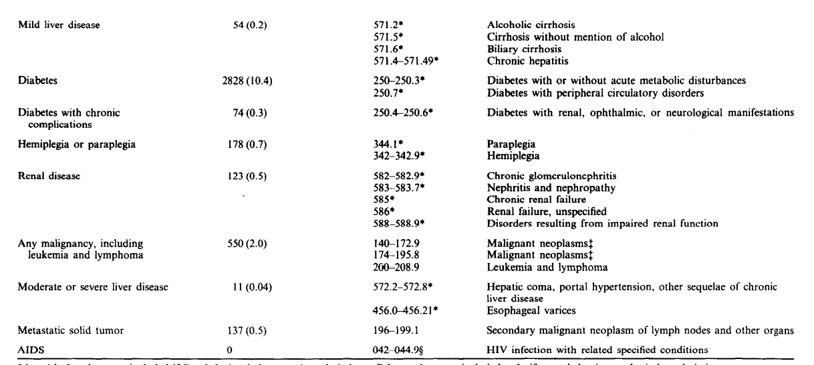
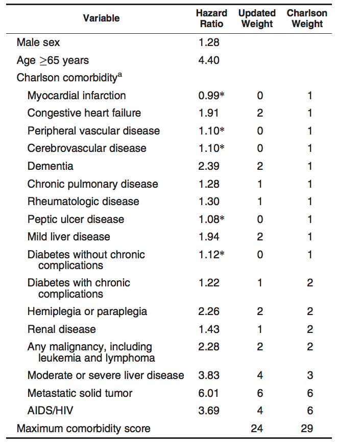
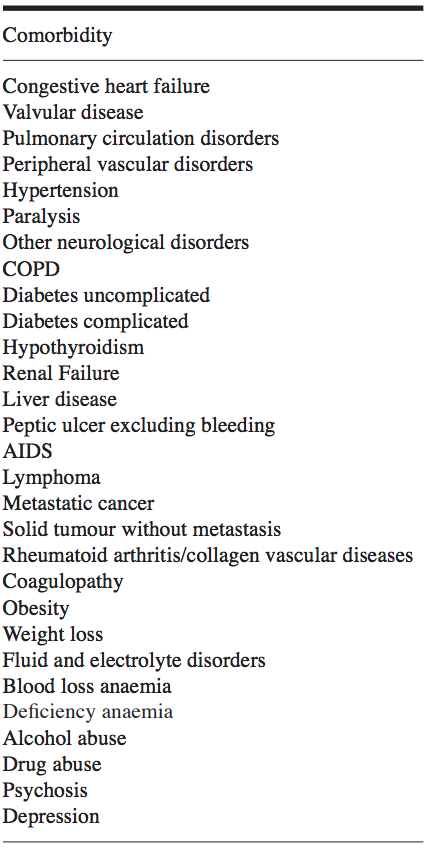

# Comorbidity Index
Comorbidity means multiple disease diagnosis for a patient. In EHR data, usually each patient at each encounter will have one primary diagnosis as well as several other non-primary diagnoses. The co-exist of such multiple disease diagnoses is called comorbidity. (Comorbidity vs. Complication: comorbidity is a pre-existing condition at admission and it is confunding to the treatment of the primary condition. Complication is a condition arising during the hospital stay, which can be considered as an adverse event. For example, for a certain procedure, the comorbidity may be diabetes and the complication may be infection). From data analysis point of view, the comorbidity is a very useful indicator for clinical outcomes such as mortality. So it is desired to summarise the comorbidity into one score. There are serveral ways to calculate the comorbidity index such as Charlson Comorbidity Index, Elixhauser Comorbidity Index and NCI Comorbidity Index. 

This python package is designed to calculate those comorbidity indices. 

  
## Original Charlson Comorbidity Index
Charlson et al. proposed this comorbidity index in their 1987 paper, [A new method of classifying prognostic comorbidity in longitudinal studies: development and validation](https://www.ncbi.nlm.nih.gov/pubmed/3558716), which has been cited more than 20,000 times since then. Based on the data of 607 patients admitted to medical service in one month period, they proposed a comorbidity index including 17 diseases with different weights. They showed that this comorbidity index is good indicator for one-year mortality. The following table shows the 17 diseases and associated weights in Charlson Comorbidity Index (table was adapted from [Comorbidity indices by Dougados](http://www.clinexprheumatol.org/abstract.asp?a=8618))

Note that in the original paper, the disease diagnosis was defined by reviewing medical charts. However, in the issurance claim data or EHR data, the disease diagnosis is defined by diagnosis code. So we need to define the diagnosis code for those diseases in the Charlson comorbidity index in order to calculate it.

  
## Charlson Comorbidity Index by Deyo et al.
In 1992, Deyo et al. provided a way to calculate the Charlson comorbidity index using ICD-9-CM code. The table below shows the mapping between the diseases defined in original Charlson index and ICD-9-CM code. The table was adapted from [Adapting a clinical comorbidity index for use with ICD-9-CM administrative databases](https://ohsu.pure.elsevier.com/en/publications/adapting-a-clinical-comorbidity-index-for-use-with-icd-9-cm-admin-3)

  
## Updated Charlson Comorbidity Index
The original Charlson Comorbidity Index was developed more than 20 years ago. In 2010, Quan et al. reevaluated the Charlson index based on a dataset of 55,929 patients. They reassigned the weights to each disease in the original Charlson index. Since five the them have updated weights of zeros, the updated Charlson Index only includes 12 diseases. The authors also validated the upated Charlson index on the external dataset from six other hospitals. The new 12-comorbidity index shows improved C-statistics for predicting mortality compared to the original one. The following table shows the 12 diseases and associated weights in updated Charlson Comorbidity Index (table was adapted from [Updating and Validating the Charlson Comorbidity Index and Score for Risk Adjustment in Hospital Discharge Abstracts Using Data From 6 Countries](https://academic.oup.com/aje/article-lookup/doi/10.1093/aje/kwq433))

  
## Elixhauser Comorbidity Index
Elixhauser et al. extended Charlson Comorbidity Index to include more diseases (total 30 diseases) in their paper [Comorbidity measures for use with administrative data](https://www.ncbi.nlm.nih.gov/pubmed/9431328). They showed that those comorbidities were associated with clinical outcomes such as length of stay, hospital charges, and mortality. The following table shows the 30 diseases or problems in Elixhauser Comorbidity Index (table was adapted from [Comorbidity indices by Dougados](http://www.clinexprheumatol.org/abstract.asp?a=8618))

  
## How to Calculate Comorbidity Index?
In order to calculate hte comorbidity index, we need to know the diagnosis. In the original Charlson Comorbidity Index paper, they reviewed the medical charts to define the patient's diagnosis. However, in the EHR data, the diagnosis is usually represented in diagnosis code (for example, ICD-9 or ICD-10 code). ICD stands for International Classification of Diseases - Medical Diagnosis Codes, which is commonly used for disease diagnosis classification. ICD-9 is the old version and ICD-10 is the new version. In order to calculate hte comorbidity index based on the ICD code, we need to map the disease diagnosis used in the comorbidity index to their corresponding ICD code. 

There is also an AHRQ version (Agency for Healthcare Research and Quality)

  
## Reference
1. Charlson ME et al. (1987): A new method of classifying prognostic comorbidity in longitudinal studies: development and validation
2. Deyo RA et al. (1992): Adapting a clinical comorbidity index for use with ICD-9-CM administrative databases
3. Quan H et al. (2005): Translated the Charlson and Elixhauser comorbidity indexed into ICD-10

